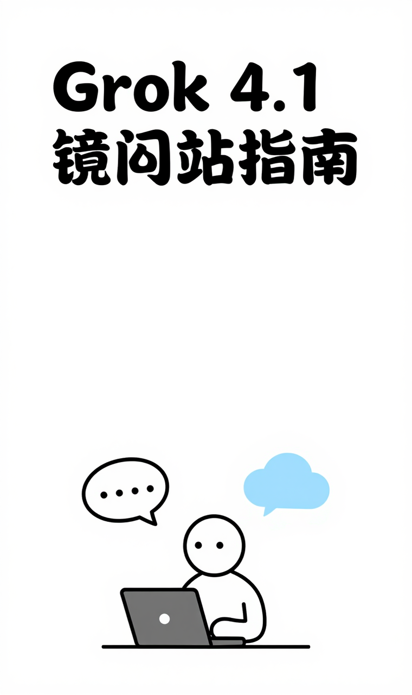
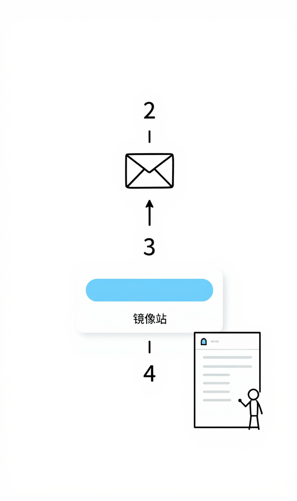
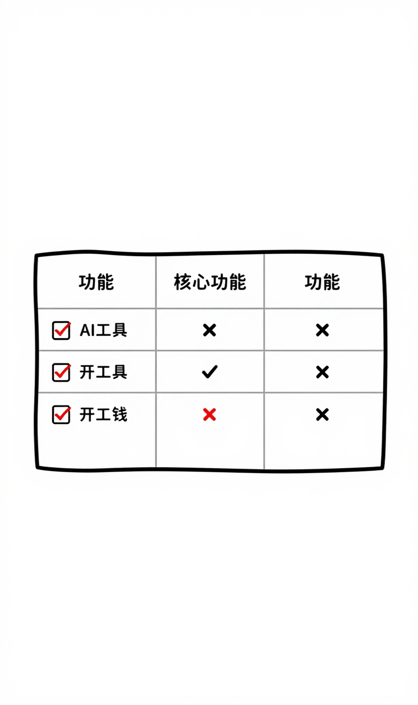
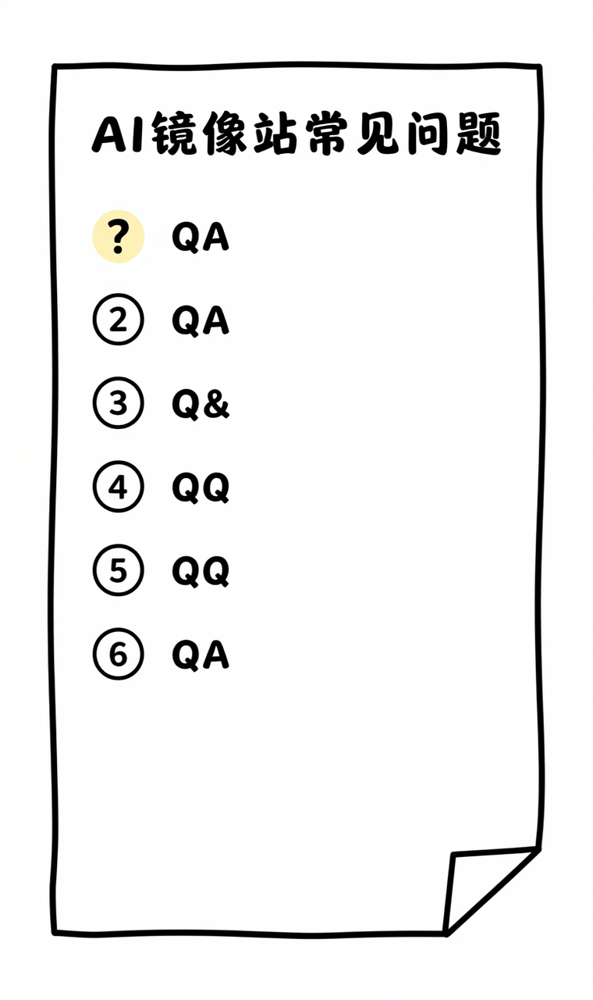

# Grok 4.1官网镜像站使用指南（国内直连）



## ✅ 精选入口

- **主入口**：https://geminiai.asia/list/#/home
- **备用入口**：https://claudeapp.asia/list/#/home
- **镜像导航**：https://chatgpt-plus.top/

## 📋 目录导航

- [什么是 Grok 4.1？](#什么是-grok-4-1)
- [为什么选择镜像网站？](#为什么选择镜像网站)
- [精选镜像站推荐](#精选镜像站推荐)
- [核心优势与功能](#核心优势与功能)
- [快速开始使用](#快速开始使用)
- [官网与镜像站对比](#官网与镜像站对比)
- [核心功能详解](#核心功能详解)
- [常见问题FAQ](#常见问题faq)
- [隐私安全建议](#隐私安全建议)
- [总结与行动建议](#总结与行动建议)

---

## 什么是 Grok 4.1？


Grok 4.1 是由 xAI 开发的人工智能助手，Grok 4.1 (2025年最新)。

### 核心特点

1. **实时信息**
2. **X平台集成**
3. **Think推理模式**
4. **幽默风格**

### 主要应用场景

- 实时资讯
- 社交媒体
- 创意写作
- 趋势分析

---

## 为什么选择镜像网站？

### 国内访问优势

1. **无需翻墙**：直接访问，无需VPN
2. **速度更快**：国内CDN加速，响应迅速
3. **稳定可靠**：多节点部署，高可用性
4. **完全免费**：无需付费，功能完整

### 镜像站 vs 官网

| 对比项 | 官网 | 镜像站 |
|--------|------|--------|
| 访问方式 | 需要VPN | 直接访问 |
| 访问速度 | 较慢 | 快速 |
| 稳定性 | 一般 | 高 |
| 费用 | 需付费 | 免费 |
| 功能 | 完整 | 完整 |

---

## 精选镜像站推荐



### 主入口（推荐）⭐

**链接**：https://geminiai.asia/list/#/home

**特点**：
- ✅ 速度快，稳定性高
- ✅ 界面友好，易于使用
- ✅ 功能完整，定期更新

### 使用步骤

1. **访问镜像站**
   - 点击上方主入口链接
   - 无需注册，直接使用

2. **开始对话**
   - 在输入框输入问题
   - 等待AI回复

3. **高级功能**
   - 上传文件（支持多种格式）
   - 多轮对话
   - 导出对话记录


### 备用入口

**链接**：https://claudeapp.asia/list/#/home

**说明**：主入口无法访问时使用


### 镜像导航站

**链接**：https://chatgpt-plus.top/

**说明**：汇总多个AI工具镜像站，一站式访问

---

## 核心优势与功能



### Grok 4.1 的核心优势


#### 1. 实时信息

[详细说明...]


#### 2. X平台集成

[详细说明...]


#### 3. Think推理模式

[详细说明...]


#### 4. 幽默风格

[详细说明...]


### 功能对比

| 功能 | Grok 4.1 | 其他AI工具 |
|------|----------------|-----------|
| 文本生成 | ✅ 优秀 | ✅ 良好 |
| 代码编写 | ✅ 优秀 | ✅ 良好 |
| 多模态 | ✅ 支持 | ⚠️ 部分支持 |
| 上下文长度 | ✅ 超长 | ⚠️ 一般 |

---

## 快速开始使用


### 基础使用

#### 1. 文本对话

```
你：请帮我写一篇关于AI的文章
AI：[生成文章内容...]
```

#### 2. 代码编写

```
你：用Python写一个快速排序
AI：[生成代码...]
```

#### 3. 文件分析

- 上传PDF、Word、Excel等文件
- AI自动分析内容
- 回答相关问题

### 高级技巧

#### 提示词优化

**基础提示词**：
```
写一篇文章
```

**优化后**：
```
请以专业的口吻，写一篇1000字的文章，主题是人工智能的发展趋势，
包含以下要点：
1. 当前AI技术现状
2. 未来发展方向
3. 对社会的影响
```

#### 多轮对话

1. 先提出总体需求
2. 根据回复细化要求
3. 逐步完善结果

---

## 官网与镜像站对比

### 功能对比

| 功能 | 官网 | 镜像站 |
|------|------|--------|
| 基础对话 | ✅ | ✅ |
| 文件上传 | ✅ | ✅ |
| 多轮对话 | ✅ | ✅ |
| 历史记录 | ✅ | ✅ |
| 自定义设置 | ✅ | ✅ |

### 访问对比

| 对比项 | 官网 | 镜像站 |
|--------|------|--------|
| 需要VPN | ✅ 是 | ❌ 否 |
| 访问速度 | ⚠️ 慢 | ✅ 快 |
| 稳定性 | ⚠️ 一般 | ✅ 高 |
| 注册要求 | ✅ 需要 | ❌ 不需要 |

---

## 核心功能详解

### 1. 文本生成

- 文章写作
- 内容改写
- 摘要提取
- 翻译服务

### 2. 代码编写

- 多语言支持
- 代码解释
- Bug修复
- 代码优化

### 3. 数据分析

- 文件解析
- 数据可视化
- 趋势分析
- 报告生成

### 4. 创意辅助

- 头脑风暴
- 方案设计
- 内容策划
- 创意生成

---

## 常见问题FAQ



### Q1: 镜像站安全吗？

**A**: 镜像站使用HTTPS加密传输，但建议：
- ❌ 不要输入个人敏感信息（身份证、银行卡等）
- ❌ 不要输入公司机密信息
- ✅ 可以用于学习、创作、编程等场景

### Q2: 镜像站会收费吗？

**A**: 目前推荐的镜像站都是免费的，但可能有以下限制：
- 每日使用次数限制
- 单次对话长度限制
- 部分高级功能需要注册

### Q3: 镜像站和官网有什么区别？

**A**: 
- **相同点**：功能基本一致，使用体验相似
- **不同点**：镜像站国内可直接访问，速度更快

### Q4: 如果镜像站无法访问怎么办？

**A**: 
1. 尝试备用入口
2. 访问镜像导航站，查找其他可用镜像
3. 清除浏览器缓存后重试

### Q5: 可以在手机上使用吗？

**A**: 可以！镜像站支持手机浏览器访问，体验与电脑端一致。

### Q6: 对话记录会保存吗？

**A**: 
- 未注册用户：对话记录保存在浏览器本地
- 注册用户：对话记录保存在服务器（建议定期导出）

### Q7: 支持哪些文件格式？

**A**: 
- 文档：PDF、Word、TXT、Markdown
- 表格：Excel、CSV
- 图片：JPG、PNG、GIF
- 代码：各种编程语言文件

### Q8: 如何获得更好的回复质量？

**A**: 
1. 提供清晰具体的问题描述
2. 给出必要的背景信息
3. 明确期望的输出格式
4. 使用多轮对话逐步完善

---

## 隐私安全建议

### ❌ 不建议输入的信息

- 个人身份信息（身份证、护照等）
- 金融信息（银行卡、密码等）
- 公司机密信息
- 他人隐私信息

### ✅ 适合的使用场景

- 学习辅助（作业、论文）
- 编程开发（代码、调试）
- 内容创作（文章、方案）
- 数据分析（公开数据）
- 创意设计（头脑风暴）

### 🔒 安全使用习惯

1. **定期清理**：定期清除对话记录
2. **谨慎分享**：不要分享包含敏感信息的对话
3. **备份重要内容**：及时导出重要对话记录
4. **使用多个镜像**：不要在单一镜像站存储所有信息

---

## 总结与行动建议

### 核心要点

1. **Grok 4.1** 是 xAI 开发的强大AI助手
2. **镜像站** 提供国内直连访问，速度快、稳定
3. **免费使用** 大部分功能，无需VPN
4. **注意隐私** 不要输入敏感信息

### 立即开始

1. 点击上方 **主入口** 链接
2. 开始你的第一次对话
3. 探索更多功能

### 推荐阅读

- [Grok 4.1 官方文档](https://example.com)
- [AI工具使用技巧](https://example.com)
- [提示词工程指南](https://example.com)

---

## 更新日志

- **2025-01-17**: 创建文档，添加最新镜像站链接
- 持续更新中...

---

**免责声明**：本指南仅供学习交流使用，镜像站链接来自互联网公开资源。使用时请遵守相关法律法规和平台使用条款。

**最后更新**：2025年1月17日

---

**觉得有用？欢迎分享给需要的朋友！⭐**
